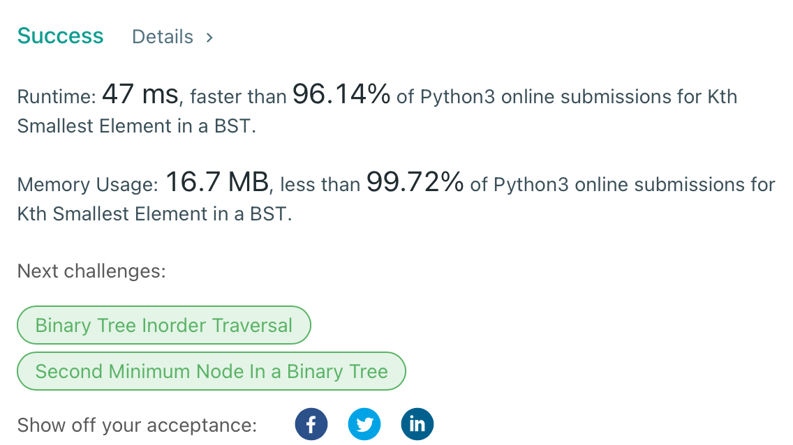
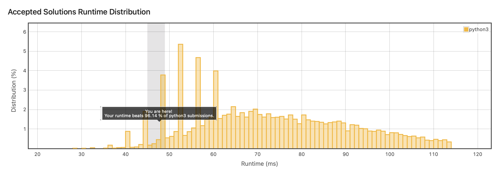
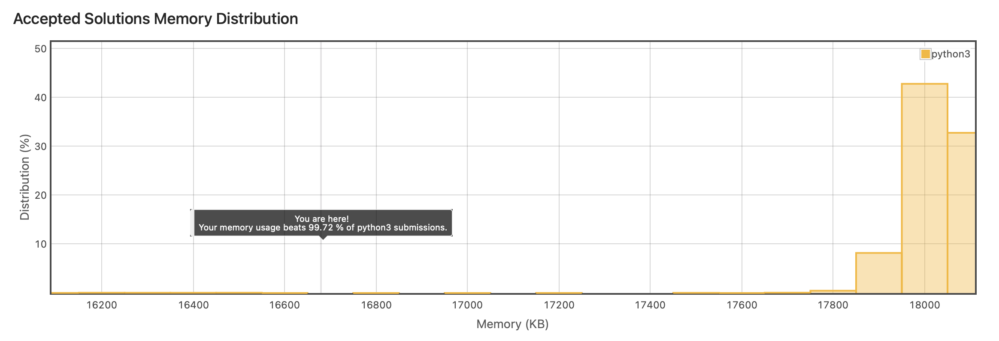

Storage of Practicing LeetCode(https://leetcode.com/)

tool: python3

# Best Score

## Counting Bits (2022 March)

문제: 0부터 주어진 수(n)를 2진수로 변환했을 때 각 '1'의 갯수를 반환하는 array(List) return.  
<접근 방법>
1. 2진수의 자리는 (log2)+1 개의 패턴이 있다. 
2. 자리수가 올라가는 패턴은 그 전 자리수가 올라갈 때와 동일하다. 

ex) 
1(0): [1]  2(1): [1],[1,2] 
4(2): [1], [1, 2], [1, 2, 2, 3] 
16(3): [1], [1, 2], [1, 2, 2, 3], [1, 2, 2, 3, 2, 3, 3, 4]  
즉, (log2)+1 만큼 반복하는 각 패턴마다 이전 패턴에서 1만큼 더해준 값을 추가하고 다음 패턴을 위해 저장하면 된다. 
-> Runtime과 Memory 효율 모두 O(n)

## Kth Smallest Element in a BST (2022 April)

문제: BST의 root가 주어졌을 때 BST에서 k 번째로 작은 value를 return하라.
<접근 방법>
1. 런타임 O(n)으로 만들기 위해서는 BST를 decoding하는 과정에서 역으로 순서를 조회해야 함.
2. 역으로 node를 올라가기 위해서는 모든 left node를 조회하여 데이터를 쌓아야 하는데, 메모리 효율 O(n)을 위하여 FILO 형식의 stack 규칙을 따르기로 결정.
3. 모든 left에 대해서 stack으로 쌓아 놓고 없으면 stack pop 한 뒤 right 조회하는 방향으로 결정.

-> Runtime과 Memory 효율 모두 O(n)