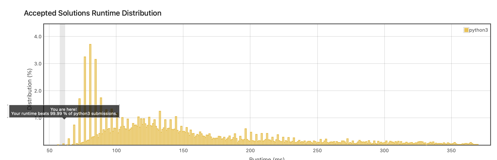

Storage of Practicing LeetCode(https://leetcode.com/)

tool: python3

# Best Score

## Counting Bits (2022 March)

문제: 0부터 주어진 수(n)를 2진수로 변환했을 때 각 '1'의 갯수를 반환하는 array(List) return.  
<접근 방법>
1. 2진수의 자리는 (log2)+1 개의 패턴이 있다. 
2. 자리수가 올라가는 패턴은 그 전 자리수가 올라갈 때와 동일하다. 

ex) 
1(0): [1]  2(1): [1],[1,2] 
4(2): [1], [1, 2], [1, 2, 2, 3] 
16(3): [1], [1, 2], [1, 2, 2, 3], [1, 2, 2, 3, 2, 3, 3, 4]  
즉, (log2)+1 만큼 반복하는 각 패턴마다 이전 패턴에서 1만큼 더해준 값을 추가하고 다음 패턴을 위해 저장하면 된다. 
-> Runtime과 Memory 효율 모두 O(n)

